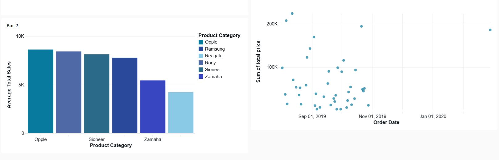

# Retail Dashboard — Databricks Lakeview



Dashboard de análise de vendas para uma organização de varejo, construído com **Databricks Lakeview** (`.lvdash.json`).

## Visão Geral

O dashboard centraliza métricas de vendas em um único painel interativo, permitindo filtrar por categoria de produto e acompanhar o desempenho comercial ao longo do tempo.

## O que o Dashboard Entrega

- **Acompanhamento de metas** — Progresso em tempo real em relação à meta mensal de R$ 3.000.000, com indicador visual claro de atingimento.
- **Análise por categoria de produto** — Comparativo de desempenho médio entre marcas (Opple, Sioneer, Zamaha e outras), permitindo identificar quais produtos impulsionam os resultados.
- **Visão temporal** — Evolução das vendas totais e do número de vendas ao longo de três meses, facilitando a identificação de tendências e padrões sazonais.

## Fonte de Dados

Catálogo Databricks:

```
databricks_simulated_retail_customer_data.v01
```

| Dataset | Tabela / Query |
|---|---|
| `customers` | `v01.customers` |
| `sales_orders` | `v01.sales_orders` |
| `sales` | `v01.sales` |
| `Sales Goal` | Total de vendas vs. meta de R$ 3.000.000 |
| `Sales Over Three Months` | Vendas de ago–out 2019 por mês e categoria |

## Widgets do Dashboard

### 1. Sales Goal (Counter)
Exibe o total de vendas acumulado comparado à meta de **R$ 3.000.000**. O valor fica destacado em vermelho quando abaixo da meta.

### 2. Sales Over Three Months (Combo Chart)
Gráfico combinado (barras + linha) com:
- **Eixo primário (Y)**: Total de vendas em BRL por mês (ago, set, out de 2019)
- **Eixo secundário (Y)**: Número de vendas no mesmo período

### 3. Average Sales by Product Category (Bar Chart)
Barras horizontais mostrando a **média de vendas por categoria de produto**, com cores distintas para cada marca:

| Marca | Cor |
|---|---|
| Ramsung | `#2A499B` |
| Reagate | Tema padrão |
| Rony | `#4E69A6` |
| Sioneer | `#2B6B89` |
| Zamaha | `#3847C1` |

### 4. Daily Sales Over Time (Scatter Plot)
Dispersão de vendas diárias (`order_date` × `sum(total_price)`), útil para identificar sazonalidades e picos.

### 5. Product Category Filter
Filtro de seleção única para categoria de produto. Categorias disponíveis:
`Opple`, `Ramsung`, `Reagate`, `Rony`, `Sioneer`, `Zamaha`

O filtro afeta os widgets **Sales Goal** e **Sales Over Three Months**.

## Como Importar

1. Acesse seu workspace Databricks.
2. Vá em **Dashboards** > **Import**.
3. Faça upload do arquivo `Retail Dashboard.lvdash.json`.
4. Certifique-se de que o catálogo `databricks_simulated_retail_customer_data.v01` está acessível no seu ambiente.

## Requisitos

- Databricks Runtime com suporte a Lakeview Dashboards
- Permissão de leitura no catálogo `databricks_simulated_retail_customer_data.v01`
- Moeda configurada em **BRL (Real Brasileiro)**
